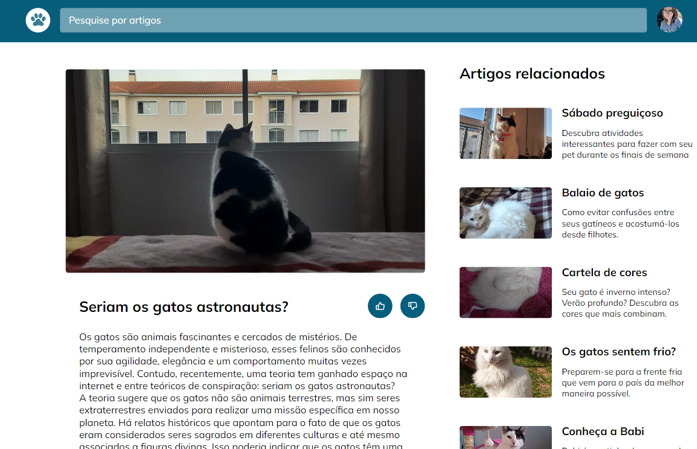

# Blog de Gatos

Desafio do curso Explorer da Rocketseat para aplicar grid, responsividade e animações.

Versões presentes: 

- Desktop;
- Mobile;
- Unidade de medida flexível;
- Grid;
- Variáveis no CSS;
- Animações e transições simples;

Versão Mobile:

Versão Desktop:

